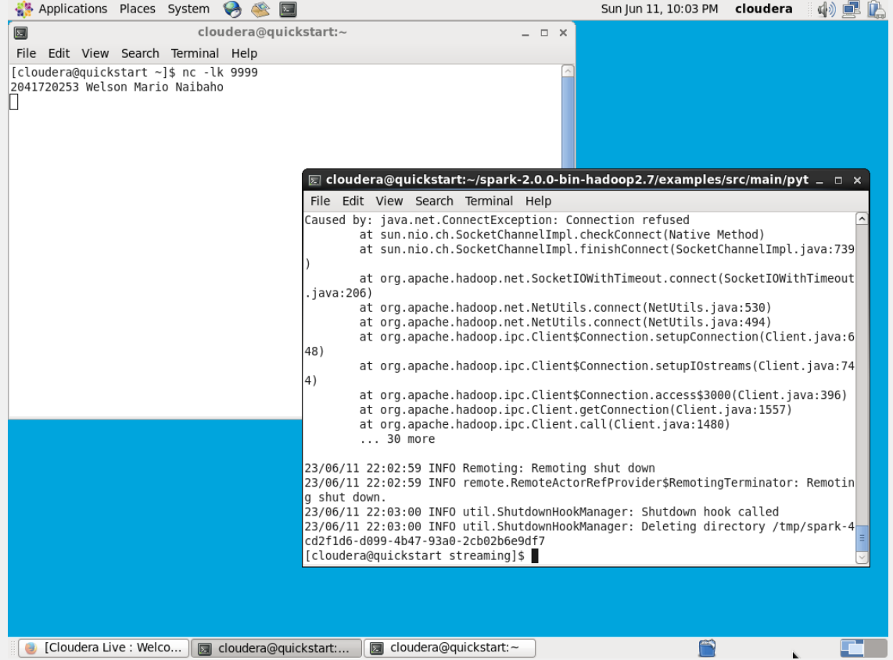
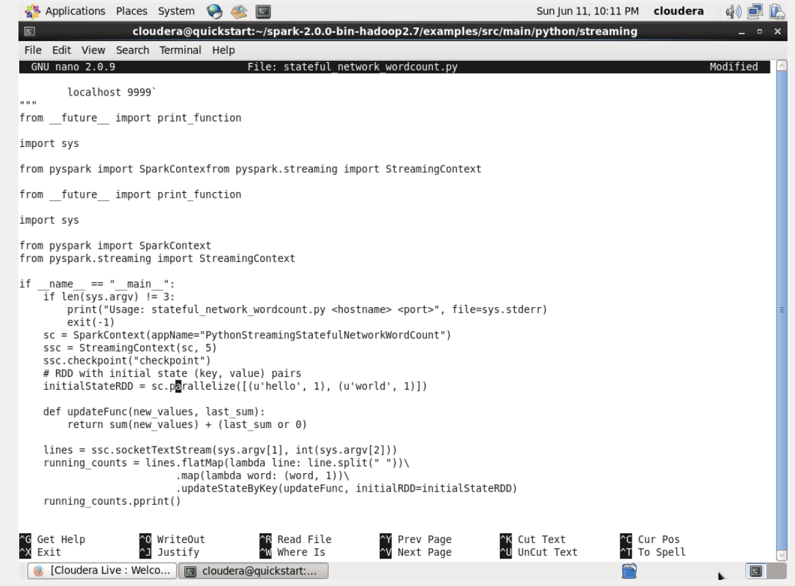
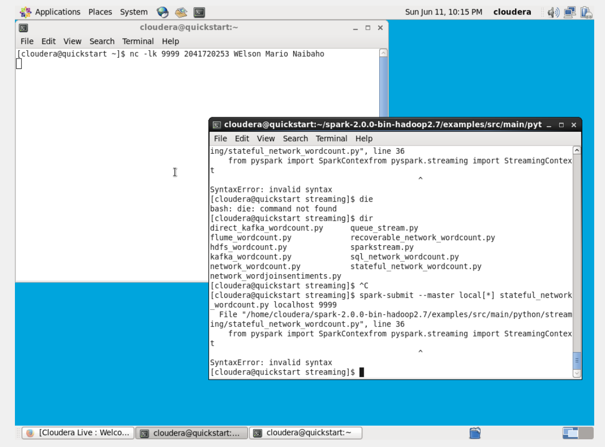
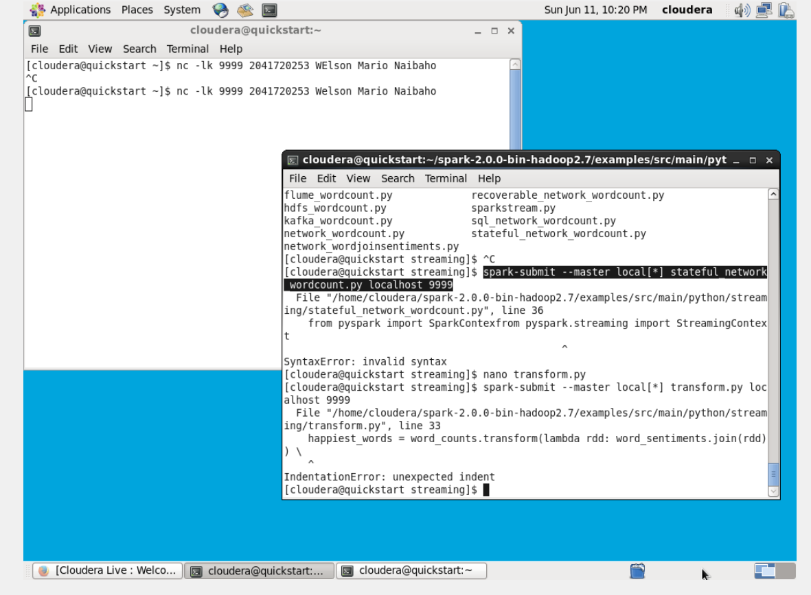

# SPARK MACHINE LEARNING
NAMA : Welson Mario Naibaho

KELAS : TI 3C

NIM : 2041720253

MATAKULIAH : BIG DATA
# CHAPTER 5
# PRAKTIKUM / LANGKAH-LANGKAH

### Metode 1 - Mode Stateless Stream Process
- Menjalankan file dengan 2 terminal, side terminal untuk mengirimkan nilai, main termainal untuk output dari side terminal, disini file error

- Isi dari file <code>stateful_network_wordcount.py</code>

### Metode 2 - Mode Stateful Stream Process
- Pada file <code>stateful_network_wordcount.py </code> ini juga terdapat error invalid syntax

### Kode 5 - Spark Transformasi
- melakukan transformasi data dengan sentimen kata sederhana

# TUGAS TEORI PRAKTIKUM 
## KODE 1

<code>sys.argv</code> berfungsi untuk mengakses argumen baris perintah yang diberikan saat menjalankan program Python.

<code>sys.stderr</code> berfungsi untuk mengakses aliran (stream) standar kesalahan (error stream) dalam program Python.

<code>StreamingContext</code> digunakan untuk membuat konteks streaming dalam aplikasi Spark Streaming.

<code>sc</code> digunakan untuk menghubungkan aplikasi Python dengan cluster Spark

<code>socketTextStream</code> digunakan untuk membaca aliran data dari socket TCP.

<code>reduceByKey</code> digunakan untuk menggabungkan nilai-nilai yang sama berdasarkan kunci (key) dalam proses pemrosesan data terdistribusi.

<code>lambda line</code> digunakan untuk membuat fungsi anonim dalam Python

<code>awaitTermination</code> digunakan untuk menjalankan aplikasi Spark Streaming dalam mode aktif dan menunggu hingga pemrosesan aliran data selesai atau dihentikan.

## KODE 2

<code>nc</code> digunakan sebagai sumber data untuk menguji dan mendemonstrasikan aliran data secara lokal. nc juga digunakan untuk membuat sumber data aliran teks dari koneksi socket TCP atau UDP.

<code>lk</code> untuk menjalankan dalam mode mendengarkan. Mode mendengarkan ini digunakan untuk membuat nc membuka koneksi socket pada port tertentu dan secara pasif menunggu koneksi masuk dari pihak lain.

## KODE 3

<code>spark-submit</code> perintah baris perintah yang digunakan untuk mengirimkan aplikasi Spark ke cluster Spark untuk dieksekusi. perintah ini juga berfungsi untuk mengirimkan aplikasi yang telah dikembangkan kepada cluster dan menjalankannya secara terdistribusi.

<code>master</code> adalah sebuah argumen atau opsi yang digunakan dalam perintah spark-submit atau saat membuat SparkContext untuk menentukan di mana aplikasi Spark akan dijalankan.

<code>local[*]</code> adalah salah satu nilai yang dapat digunakan untuk argumen master dalam perintah spark-submit atau saat membuat SparkContext. Ini adalah salah satu mode implementasi yang memungkinkan aplikasi Spark dijalankan secara lokal pada semua core CPU yang tersedia di mesin lokal.

## CODE 4

<code>ssc.checkpoint</code> digunakan untuk mengatur titik kontrol (checkpoint) pada StreamingContext

<code>parallelize</code> digunakan pada objek SparkContext untuk membuat sebuah Resilient Distributed Dataset (RDD) dari koleksi data yang ada di dalam program.

<code>updateStateByKey</code> digunakan untuk melakukan pembaruan state (keadaan) dari kunci yang sama dalam setiap batch data yang masuk

<code>flatMap</code> digunakan pada RDD untuk melakukan operasi transformasi pada setiap elemen RDD dan menghasilkan nol atau lebih keluaran untuk setiap elemen tersebut. 

### CODE 5

<code>rdd.take(5)</code> untuk mengambil 5 elemen teratas dari RDD tersebut. Metode ini mengembalikan list yang berisi elemen-elemen tersebut.

<code>transform</code> untuk melakukan transformasi kompleks atau kustom pada setiap elemen RDD dan menghasilkan RDD baru

<code>rdd.sortByKey(False)</code> untuk mengurutkan elemen RDD berdasarkan kunci (key) secara menaik atau menurun. Metode ini mengembalikan RDD baru yang berisi elemen-elemen yang diurutkan berdasarkan kunci.